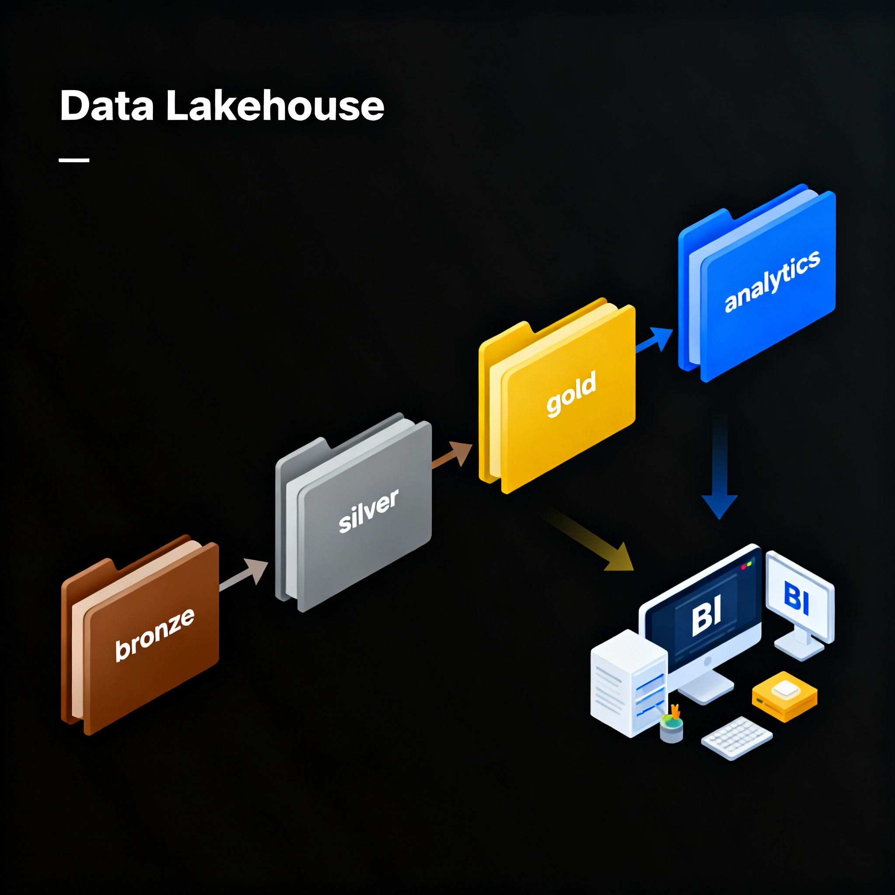

# Automated Data Quality Pipeline with Apache Airflow  

## 📌 Introduction  
In today’s data-driven world, data quality is essential for reliable analytics and decision-making.  
This project implements a **Lakehouse pipeline** based on the **Medallion Architecture** (Bronze → Silver → Gold), fully orchestrated using **Apache Airflow**.  

The pipeline ingests raw data, applies cleaning and validation checks, and produces analytics-ready outputs with automated aggregation in the Gold layer.  


## 🎯 Objectives  
- Build a modular **Lakehouse pipeline** using Airflow.  
- Apply **automated data quality checks** (cleaning, type casting, validation).  
- Generate **Gold layer outputs** optimized for analytics.  
- Ensure **reproducibility, modularity, and extensibility** for future datasets.  


## 🛠️ Tools & Technologies  
- **Apache Airflow (2.7.2)** – Orchestration and scheduling of pipeline tasks.  
- **Python (pandas)** – Data cleaning, validation, and transformation.  
- **CSV datasets** – Input and output format.  
- **Docker** – Containerized Airflow environment for portability.  


## 🏗️ Architecture  

The project follows the **Medallion Architecture** design pattern:  

| Layer  | Purpose |
|--------|---------|
| **Bronze** | Raw data stored as-is without modification. |
| **Silver** | Cleaned & validated data with missing, invalid, and inconsistent values handled. |
| **Gold** | Aggregated and summarized tables optimized for reporting and insights. |

📌 The pipeline is implemented as an **Airflow DAG**, ensuring each stage runs sequentially and reproducibly.  




## ⚙️ Pipeline DAG

The pipeline DAG (lakehouse_pipeline.py) defines the following tasks:

1. clean_missing – Removes or imputes missing values.

2. clean_invalid – Removes inconsistent or invalid records.

3. clean_datetime – Standardizes datetime formats.

4. cast_types – Ensures columns have the correct datatypes.

5. validate_data – Runs validation checks and generates a report.

6. transform_gold – Aggregates data into Gold layer analytics tables.

## 📂 Repository Structure
```
lakehouse_airflow_project/  
│   
├── dags/   
│   └── lakehouse_pipeline.py     # Airflow DAG 
│   
├── scripts/               # ETL scripts    
│   ├── clean_missing.py    
│   ├── clean_invalid.py    
│   ├── clean_datetime.py   
│   ├── cast_types.py   
│   ├── validate.py 
│   └── transform.py    
│   
├── data/   
│   └── sample_input.csv  
│
├── diagrams/             
│   └── architecture.png
│
├── REPORT.pdf                     
└── README.md                      
```

## 🚀 Running the Project Locally

## 1. Prerequisites

Install Docker Desktop (latest version).

Ensure Docker is running.

## 2. Start Airflow with Docker Compose

From the project root folder (where docker-compose.yml is located):

```
docker compose up -d
```
This will trigger up the Airflow environment (scheduler, webserver, PostgreSQL, etc.).

```
docker compose down
```
To shut down your Airflow project containers

## 3. Access Airflow UI

- Open http://localhost:8080 in your browser.

- Login with:

    #### Username: airflow

    #### Password: airflow

## 4. Trigger the Pipeline

 - Go to DAGs in the Airflow UI.

 - Enable and run lakehouse_pipeline.

 - Monitor task execution and logs from the Airflow dashboard.

## 5.  Outputs

- Silver Layer: Cleaned + validated CSV files.

- Gold Layer: Aggregated summary table (trip_summary.csv).

## 📊 Gold Layer Output

- The Gold layer table (trip_summary.csv) is generated in transform.py.

- Data is aggregated over thousands of rows of cleaned input.

- Grouping is applied (e.g., passenger_count) and averaging over numerical fields like fare amount, tip amount, and trip distance.

This produces analytics-ready data for visualization, dashboards, or further insights.

## ✅ Results

- Fully automated end-to-end pipeline orchestrated with Airflow.

- Cleaned & validated Silver layer datasets with a validation report.

- Generated Gold layer aggregated summaries for analysis.

- Reproducible and modular design for future datasets.

## 📚 Key Learnings

Hands-on experience with Airflow DAG design and orchestration.

Application of data quality principles inside a Lakehouse pipeline.

Debugging in Dockerized Airflow environments (path issues, dependencies).

Designing modular & extendable ETL workflows.
